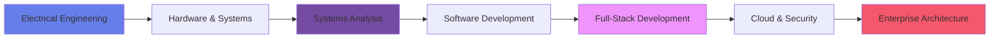

<div align="center">
  
  
  <h1>
    
    Marco Antonio Teixeira
  </h1>
  
  <h3>🚀 Full-Stack Developer & Software Engineer</h3>
  
  <p>
    <em>🎓 Electrical Engineer • 💻 Systems Analyst • ⚡ Software Engineering Specialist</em>
  </p>
  
  
  
  
  
  <br><br>
  
  
  
  <br><br>
  
  
</div>

## 👨‍💻 Professional Profile

<div align="center">
  
  
  
</div>

**Experienced Software Engineer** combining **Electrical Engineering** foundation with **Full-Stack Development** expertise. Specialized in enterprise-grade applications, cloud architecture, and security-focused development practices.

### 🎓 Academic Background
- **🔌 Bachelor's in Electrical Engineering**
- **💻 Graduate in Systems Analysis & Development**
- **⚡ Post-Graduate Specialization in Software Engineering**

### 🎯 Current Focus
- Building scalable microservices with **Java & Spring Boot**
- Modern frontend development with **React & Angular**
- Cloud-native solutions on **GCP**
- Security-first development practices

## 🛠️ Technology Stack

### 🔥 Backend & Architecture
<div align="center">
  
  
  
  
  
  
</div>

### 🎨 Frontend Development
<div align="center">
  
  
  
  
  
</div>

### 🗄️ Databases & Storage
<div align="center">
  
  
  
  
  
</div>

### ☁️ Cloud & DevOps
<div align="center">
  
  
  
  
  
</div>

### 🔒 Security & Quality
<div align="center">
  
  
  
  
</div>

### 🧪 Testing & Build Tools
<div align="center">
  
  
  
  
</div>

## 🏆 Professional Highlights

<table>
  <tr>
    <td align="center">🎓</td>
    <td><strong>Triple Academic Foundation</strong><br>Electrical Engineering + Systems Analysis + Software Engineering</td>
  </tr>
  <tr>
    <td align="center">⚡</td>
    <td><strong>Full-Stack Expertise</strong><br>From hardware understanding to cloud-native software architecture</td>
  </tr>
  <tr>
    <td align="center">🔒</td>
    <td><strong>Security Champion</strong><br>Security-first development with Checkmarx and best practices</td>
  </tr>
  <tr>
    <td align="center">☁️</td>
    <td><strong>Cloud Native</strong><br>GCP, Docker, Rancher for scalable container orchestration</td>
  </tr>
  <tr>
    <td align="center">🚀</td>
    <td><strong>Enterprise Experience</strong><br>Building scalable applications with modern frameworks</td>
  </tr>
</table>

## 💼 Professional Journey


```
� Contact
LinkedIn: 

www.linkedin.com

Email: m.antonyteixeira@gmail.com

GitHub: 

github.com

💡 "Engineering the future, one line of code at a time"


Thanks for visiting! ��

```
